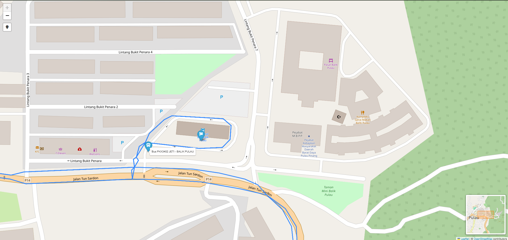

# Rapid Penang Bus Tracker

This website allows you to track the whereabouts of the buses and what route they are on

# Demo Pics

# How to run it
1. Install the deps
 - pandas
 - requests
 - folium
 - flask_cors
 - flask
 - gtfs-realtime-bindings
2. Run the mapbuilder once
3. Setup a cron job to run the map builder every 45 minutes
4. Run the bus_realtime_server
5. Serve the api server on a subdomain of your choice
6. Edit the api url in mapbuilder
7. Run the mapbuilder manually
8. Daemonize the api server
9. Serve the html page
